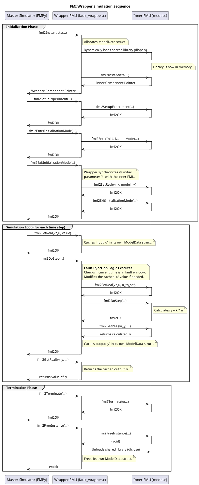

![[Pasted image 20250828143013.png]]
This C file implements the logic for a **wrapper FMU**. Its primary purpose is to load another "inner" FMU, intercept the data flow between the simulation environment and the inner FMU, and inject fault behavior according to **predefined** rules.

#### 1. Header Includes and Platform Abstraction

```c
#include <stdio.h>
#include <stdlib.h>
#include <string.h>

#include "fmi2Functions.h"

// Platform-specific headers and functions for dynamic library loading
#ifdef _WIN32
#include <windows.h>
#define DLL_HANDLE HMODULE
#define LOAD_LIBRARY(path) LoadLibrary(path)
#define GET_FUNCTION(handle, name) GetProcAddress(handle, name)
#define FREE_LIBRARY(handle) FreeLibrary(handle)
#define SEP "\\"
#else
#include <dlfcn.h>
#define DLL_HANDLE void*
#define LOAD_LIBRARY(path) dlopen(path, RTLD_LAZY)
#define GET_FUNCTION(handle, name) dlsym(handle, name)
#define FREE_LIBRARY(handle) dlclose(handle)
#define SEP "/"
#endif

```

- **Standard Libraries**: `stdio.h`, `stdlib.h`, and `string.h` are included for basic I/O, memory allocation, and string manipulation.
- **FMI Header**: `[fmi2Functions.h](code-assist-path:/home/likhith/Master_Thesis/fmu_sandbox/FMU_C_Wrapper/fmi2Functions.h "/home/likhith/Master_Thesis/fmu_sandbox/FMU_C_Wrapper/fmi2Functions.h")` contains the type definitions and function signatures required by the FMI 2.0 standard.
- **Platform Abstraction**: The preprocessor block (`#ifdef _WIN32 ... #else ... #endif`) is a critical piece of cross-platform design. It abstracts the operating system's API for handling dynamic libraries (`.dll` on Windows, `.so` on Linux).
    - `LOAD_LIBRARY`: A macro that maps to `LoadLibrary` (Windows) or `dlopen` (Linux/macOS) to load a shared library into memory.
    - `GET_FUNCTION`: Maps to `GetProcAddress` or `dlsym` to retrieve the memory address of a specific function within the loaded library.
    - `FREE_LIBRARY`: Maps to `FreeLibrary` or `dlclose` to unload the library.
    - `SEP`: Defines the correct directory separator for file paths.

#### 2. Constants and Definitions

```c
// --- Value References for this wrapper FMU ---
#define VR_U 0
#define VR_Y 1
#define VR_K 2

// --- Hardcoded Fault Definition ---
#define FAULT_VR 0 // VR of the variable to apply fault on (u)
#define FAULT_START_TIME 3.0
#define FAULT_END_TIME 7.0
#define FAULT_TYPE_OFFSET
#define FAULT_VALUE 0.5

```

- **Value References (VR)**: These macros give human-readable names to the integer `valueReference`s defined in the `[modelDescription.xml](code-assist-path:/home/likhith/Master_Thesis/fmu_sandbox/FMU_C_Wrapper/modelDescription.xml "/home/likhith/Master_Thesis/fmu_sandbox/FMU_C_Wrapper/modelDescription.xml")`. This makes the code cleaner and less prone to errors than using "magic numbers" like `0`, `1`, and `2` directly.
- **Fault Definition**: This section hardcodes a simple fault scenario for demonstration purposes.
    - `FAULT_VR`: The value reference of the variable to be manipulated (here, `VR_U`).
    - `FAULT_START_TIME` / `FAULT_END_TIME`: The time window during which the fault is active.
    - `FAULT_TYPE_OFFSET`: A preprocessor flag used to select the type of fault. The logic checks for its existence (`#ifdef`).
    - `FAULT_VALUE`: The value associated with the fault (e.g., the offset to be added).

#### 3. Data Structures
```c
// --- Inner FMU Function Pointers ---
typedef struct {
    fmi2InstantiateTYPE*            Instantiate;
    // ... other function pointers
    fmi2DoStepTYPE*                 DoStep;
} InnerFMU;

// --- Model Data Structure ---
typedef struct {
    // Wrapper's own variable values
    double u;
    double y;
    double k;
    double currentTime;

    // Inner FMU handles
    DLL_HANDLE innerFMUHandle;
    fmi2Component innerFMUInstance;
    InnerFMU functions;
    const fmi2CallbackFunctions* callbacks;
    fmi2String instanceName;
} ModelData;
```

- **`InnerFMU` Struct**: This structure serves as a dispatch table. It holds function pointers to all the FMI functions that the wrapper needs to call on the _inner_ FMU. Its fields are populated at runtime after the inner FMU's library is loaded.
- **`ModelData` Struct**: This is the most important data structure. An instance of `ModelData` represents a single instance of the wrapper FMU and holds its complete state.
    - `u`, `y`, `k`, `currentTime`: A cache for the wrapper's own variable values and the current simulation time.
    - `innerFMUHandle`: The handle to the loaded shared library (`.so`/`.dll`) of the inner FMU.
    - `innerFMUInstance`: The component instance pointer returned by the _inner_ FMU's `fmi2Instantiate` function.
    - `functions`: An instance of the `InnerFMU` struct, containing the pointers to the inner FMU's functions.
    - `callbacks`: A pointer to the callback functions provided by the simulation environment (used for logging and memory management).
    - `instanceName`: The unique name for this FMU instance.
#### 4. FMI Function Implementations

##### `fmi2Instantiate`

This is the entry point for creating an instance of the FMU. It performs a sequence of critical setup tasks:

1. **Allocate Memory**: Allocates memory for the `ModelData` struct.
2. **Parse Resource Path**: The `fmuResourceLocation` argument is a URI (e.g., `file:///path/to/resources`). The code correctly strips the `file://` prefix to get a valid filesystem path that `dlopen`/`LoadLibrary` can understand.
3. **Construct Library Path**: It builds the full path to the inner FMU's shared library, which the `[build.sh](code-assist-path:/home/likhith/Master_Thesis/fmu_sandbox/FMU_C_Wrapper/build.sh "/home/likhith/Master_Thesis/fmu_sandbox/FMU_C_Wrapper/build.sh")` script placed at `resources/Amplifier/binaries/<platform>/model.so`.
4. **Load Inner Library**: It calls `LOAD_LIBRARY` to load the inner FMU's binary into memory.
5. **Load Function Pointers**: It calls the `loadInnerFmuFunctions` helper, which uses `GET_FUNCTION` to look up the address of each required FMI function (e.g., "fmi2DoStep") and stores it in the `model->functions` struct.
6. **Instantiate Inner FMU**: It calls the now-loaded `Instantiate` function of the _inner_ FMU to create an instance of it. It passes a modified resource path (`.../Amplifier/resources`) so the inner FMU can find its own resources if needed.
7. **Initialize Wrapper State**: Sets the default values for the wrapper's cached variables.

##### `fmi2GetReal` / `fmi2SetReal`

These functions interact with the wrapper's internal cache (`model->u`, `model->y`, etc.). They do **not** immediately pass calls to the inner FMU. This is a key part of the wrapper pattern: the wrapper acts as the single source of truth for the simulation environment, and it decides when to synchronize its state with the inner FMU.

##### `fmi2ExitInitializationMode`

This function is called after all initial inputs and parameters have been set. It's the first point where the wrapper synchronizes its state _to_ the inner FMU by calling the inner FMU's `SetReal` function to pass down the value of the gain `k`.

##### `fmi2DoStep`

This is the heart of the wrapper's runtime logic, executed at each simulation time step.

1. **Update Time**: Caches the `currentCommunicationPoint`.
2. **Fault Injection**: It checks if the current time falls within the hardcoded fault window. If it does, it modifies the input value `u` before it gets sent to the inner FMU. In this case, it adds an offset.
3. **Set Inputs**: It calls the inner FMU's `SetReal` function, passing the (potentially faulty) input value.
4. **Advance Inner FMU**: It calls the inner FMU's `DoStep` function, telling it to perform its calculations for the time step.
5. **Get Outputs**: After the inner FMU has finished its step, the wrapper calls the inner FMU's `GetReal` to retrieve the calculated output `y` and stores it in its own cache (`model->y`). This cached value will be provided to the simulator if it calls `fmi2GetReal` on the wrapper.

##### `fmi2FreeInstance` / `fmi2Terminate`

These functions handle cleanup. They call the corresponding functions on the inner FMU instance, then unload the shared library (`FREE_LIBRARY`), and finally free the wrapper's own `ModelData` struct

##### Stub Functions
```c
fmi2Status fmi2GetInteger(...) { return fmi2Error; }
fmi2Status fmi2CancelStep(...) { return fmi2OK; }
// ... and many others
```

The FMI standard requires that a Co-Simulation FMU exports a specific set of functions. Many of these are optional or not relevant to this simple wrapper (e.g., getting/setting booleans, handling FMU state serialization). These "stub" implementations ensure the FMU is compliant. They simply return `fmi2OK` or `fmi2Error` to signal that the functionality is not supported, allowing the FMU to be loaded correctly by any FMI-compliant tool.




